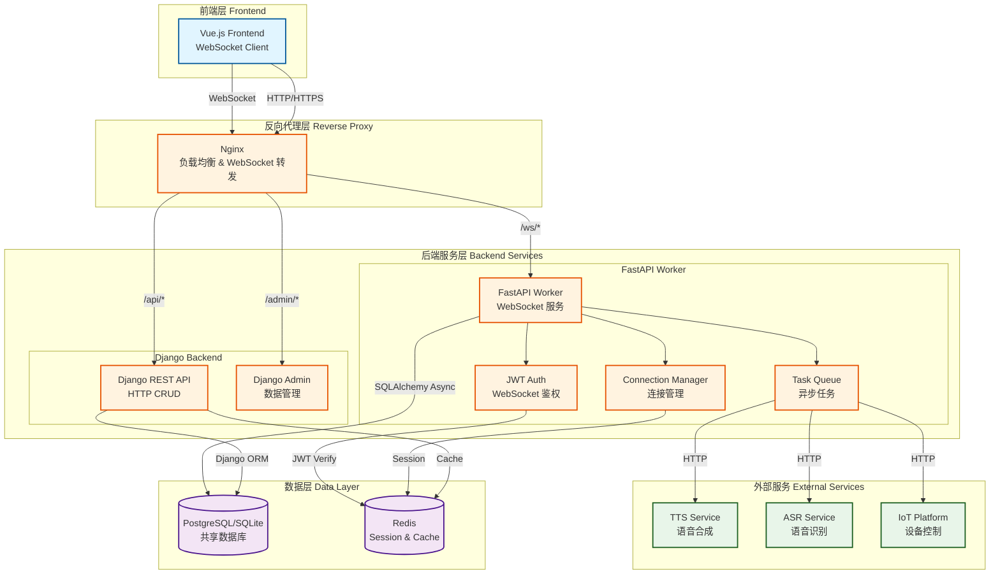
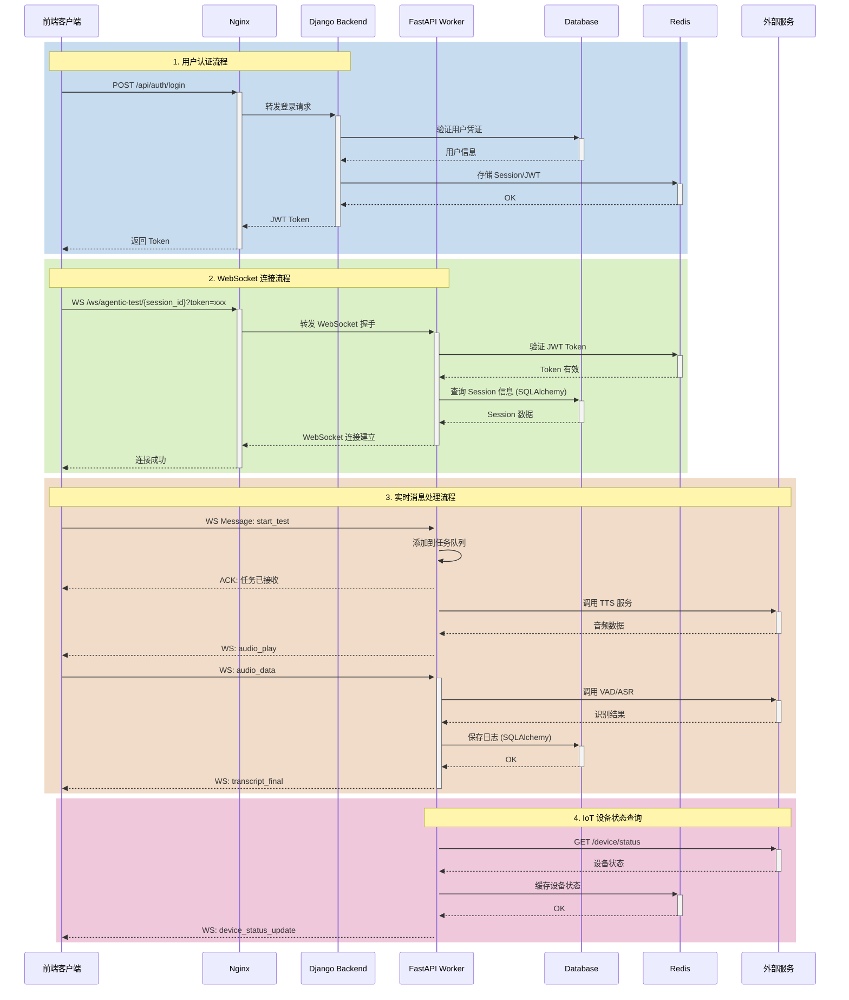

# 企业级微服务架构设计文档

## 1. 架构设计图



## 2. 数据流与认证流



## 3. 服务职责划分

### 3.1 Django Backend (HTTP 服务)
- **职责**：
  - RESTful API (CRUD 操作)
  - 用户认证与授权
  - 数据库迁移管理
  - Admin 后台管理
  - IoT 设备管理 (HTTP API)
  
- **技术栈**：
  - Django 3.2+
  - Django REST Framework
  - Django ORM
  - Channels (仅用于 ASGI 配置，不处理 WebSocket)

### 3.2 FastAPI Worker (WebSocket 服务)
- **职责**：
  - WebSocket 连接管理
  - 实时音频流处理
  - VAD/ASR/TTS 服务调用
  - 异步任务队列
  - 实时日志推送
  
- **技术栈**：
  - FastAPI
  - SQLAlchemy (Async)
  - WebSocket
  - Pydantic V2
  - asyncio

### 3.3 数据库策略
- **共享数据库**：PostgreSQL/SQLite
- **ORM 隔离**：
  - Django: Django ORM (迁移管理)
  - Worker: SQLAlchemy Async (只读/写，不做迁移)
- **数据一致性**：
  - 所有表结构由 Django 管理
  - Worker 的 SQLAlchemy Models 镜像 Django Models

## 4. 关键技术决策

### 4.1 为什么选择 FastAPI Worker？
1. **高并发 WebSocket 支持**：原生 async/await，性能优于 Django Channels
2. **类型安全**：Pydantic V2 提供强类型验证
3. **独立部署**：可独立扩展 WebSocket 服务
4. **生态丰富**：与 SQLAlchemy、Redis 集成良好

### 4.2 为什么保留 Django？
1. **成熟的 Admin 系统**：快速数据管理
2. **ORM 迁移管理**：统一的数据库版本控制
3. **现有业务逻辑**：IoT 设备管理、用户系统
4. **团队熟悉度**：降低学习成本

### 4.3 数据库访问策略
```python
# Django (backend)
from chat.models import App
app = App.objects.get(id=app_id)

# Worker (FastAPI)
from worker.models import App
async with get_db() as session:
    result = await session.execute(select(App).where(App.id == app_id))
    app = result.scalar_one()
```

## 5. 部署架构

```
┌─────────────────────────────────────────────────────────────┐
│                         Nginx (Port 80/443)                  │
│  - SSL Termination                                           │
│  - Load Balancing                                            │
│  - WebSocket Upgrade                                         │
└────────────┬────────────────────────────────┬────────────────┘
             │                                │
             ▼                                ▼
┌────────────────────────┐      ┌────────────────────────────┐
│   Django (Port 8000)   │      │  FastAPI Worker (Port 8001)│
│  - Gunicorn + Uvicorn  │      │  - Gunicorn + Uvicorn      │
│  - 4 Workers           │      │  - 4 Workers               │
└────────────┬───────────┘      └────────────┬───────────────┘
             │                                │
             └────────────┬───────────────────┘
                          ▼
             ┌────────────────────────┐
             │  PostgreSQL (Port 5432)│
             │  - Shared Database     │
             └────────────────────────┘
                          │
                          ▼
             ┌────────────────────────┐
             │    Redis (Port 6379)   │
             │  - Session Store       │
             │  - Cache Layer         │
             └────────────────────────┘
```

## 6. 安全性考虑

### 6.1 WebSocket 鉴权
```python
# JWT Token 验证流程
1. 客户端携带 token 连接: ws://host/ws/session?token=xxx
2. Worker 验证 token (Redis 或 JWT decode)
3. 验证失败立即断开连接
4. 验证成功后建立连接并关联用户
```

### 6.2 跨服务通信
- Django ↔ Worker: 通过共享数据库 + Redis
- 避免直接 HTTP 调用，减少耦合
- 使用 Redis Pub/Sub 进行事件通知（可选）

## 7. 可观测性

### 7.1 日志策略
- **结构化日志**：JSON 格式，包含 TraceID
- **日志级别**：DEBUG/INFO/WARNING/ERROR
- **日志聚合**：ELK Stack 或 Loki

### 7.2 监控指标
- WebSocket 连接数
- 消息处理延迟
- 数据库连接池状态
- 外部服务调用成功率

### 7.3 健康检查
```
GET /health
{
  "status": "healthy",
  "database": "connected",
  "redis": "connected",
  "websocket_connections": 42
}
```

## 8. 扩展性考虑

### 8.1 水平扩展
- Worker 可独立扩展多个实例
- 使用 Redis 作为 WebSocket 消息总线
- Nginx 负载均衡

### 8.2 垂直扩展
- 增加 Worker 进程数
- 优化数据库连接池
- 使用 Redis Cluster

## 9. 迁移路径

### Phase 1: 基础设施搭建 (Week 1)
- [ ] 创建 worker 目录结构
- [ ] 配置 SQLAlchemy Models
- [ ] 实现 WebSocket 连接管理
- [ ] 编写 Docker 配置

### Phase 2: 功能迁移 (Week 2)
- [ ] 迁移 WebSocket Consumers 到 FastAPI
- [ ] 实现 JWT 鉴权
- [ ] 迁移音频处理逻辑
- [ ] 集成外部服务

### Phase 3: 测试与优化 (Week 3)
- [ ] 单元测试
- [ ] 集成测试
- [ ] 性能测试
- [ ] 压力测试

### Phase 4: 部署上线 (Week 4)
- [ ] 生产环境配置
- [ ] 灰度发布
- [ ] 监控告警
- [ ] 文档完善

## 10. 风险与挑战

### 10.1 数据一致性
- **风险**：双 ORM 可能导致模型不同步
- **缓解**：自动化脚本检查模型一致性

### 10.2 事务管理
- **风险**：跨服务事务难以保证
- **缓解**：使用 Saga 模式或最终一致性

### 10.3 连接管理
- **风险**：WebSocket 连接泄露
- **缓解**：实现心跳检测和自动清理

## 11. 成本估算

### 11.1 开发成本
- 架构设计：3 天
- 代码实现：10 天
- 测试调试：5 天
- 文档编写：2 天
- **总计**：20 工作日

### 11.2 运维成本
- 服务器资源：+30% (新增 Worker 服务)
- 监控成本：+20% (新增监控指标)
- 维护成本：-10% (服务解耦，更易维护)
