# 应用类型系统架构图

## 系统整体架构

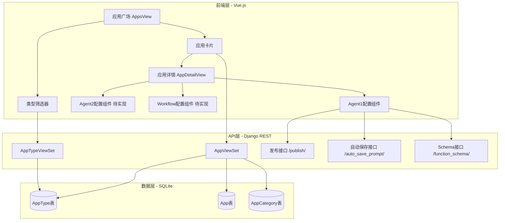
```mermaid
graph TB
    subgraph "前端层 - Vue.js"
        A[应用广场 AppsView]
        B[应用详情 AppDetailView]
        C[Agent1配置组件]
        D[Agent2配置组件 待实现]
        E[Workflow配置组件 待实现]
        F[类型筛选器]
        G[应用卡片]
    end
    
    subgraph "API层 - Django REST"
        H[AppTypeViewSet]
        I[AppViewSet]
        J[发布接口 /publish/]
        K[自动保存接口 /auto_save_prompt/]
        L[Schema接口 /function_schema/]
    end
    
    subgraph "数据层 - SQLite"
        M[(AppType表)]
        N[(App表)]
        O[(AppCategory表)]
    end
    
    A --> F
    A --> G
    G --> B
    B --> C
    B --> D
    B --> E
    
    F --> H
    G --> I
    C --> J
    C --> K
    C --> L
    
    H --> M
    I --> N
    I --> M
    I --> O
```

## 数据模型关系图

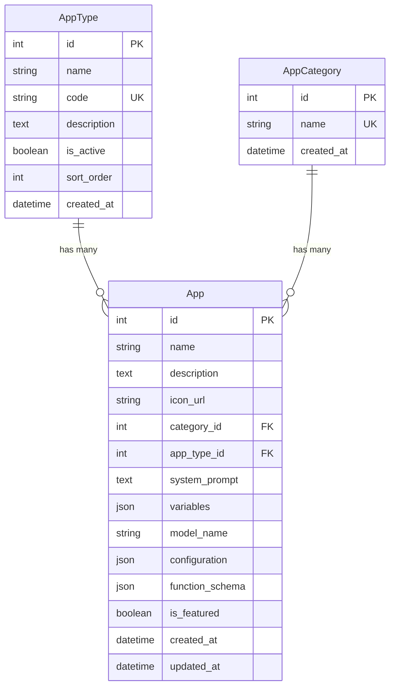
```mermaid
erDiagram
    AppType ||--o{ App : "has many"
    AppCategory ||--o{ App : "has many"
    
    AppType {
        int id PK
        string name
        string code UK
        text description
        boolean is_active
        int sort_order
        datetime created_at
    }
    
    App {
        int id PK
        string name
        text description
        string icon_url
        int category_id FK
        int app_type_id FK
        text system_prompt
        json variables
        string model_name
        json configuration
        json function_schema
        boolean is_featured
        datetime created_at
        datetime updated_at
    }
    
    AppCategory {
        int id PK
        string name UK
        datetime created_at
    }
```

## 应用创建流程

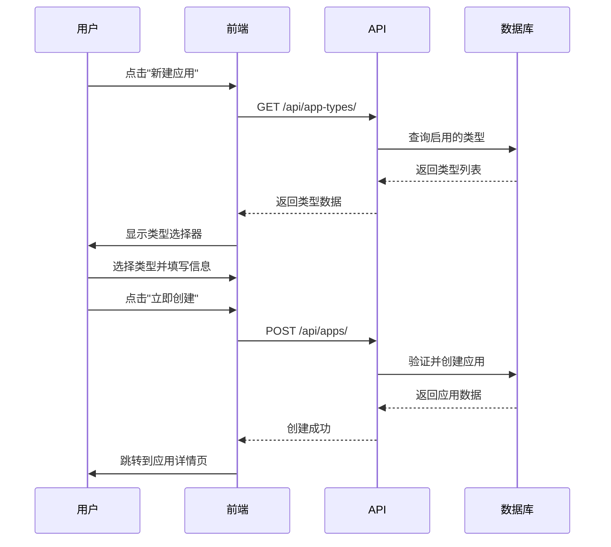
```mermaid
sequenceDiagram
    participant U as 用户
    participant F as 前端
    participant A as API
    participant D as 数据库
    
    U->>F: 点击"新建应用"
    F->>A: GET /api/app-types/
    A->>D: 查询启用的类型
    D-->>A: 返回类型列表
    A-->>F: 返回类型数据
    F->>U: 显示类型选择器
    
    U->>F: 选择类型并填写信息
    U->>F: 点击"立即创建"
    F->>A: POST /api/apps/
    A->>D: 验证并创建应用
    D-->>A: 返回应用数据
    A-->>F: 创建成功
    F->>U: 跳转到应用详情页
```

## 应用配置和发布流程

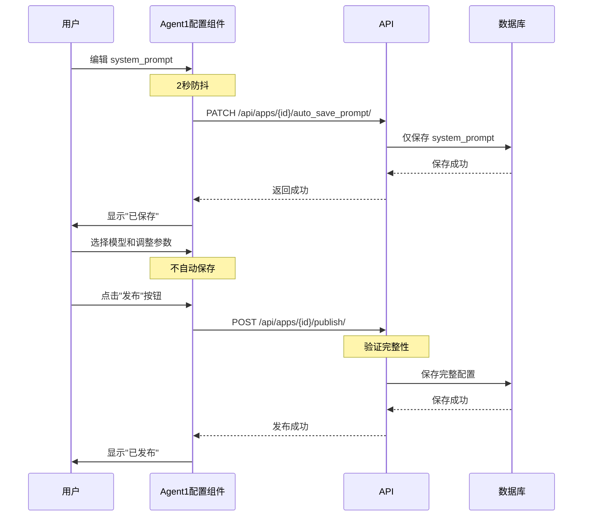
```mermaid
sequenceDiagram
    participant U as 用户
    participant C as Agent1配置组件
    participant A as API
    participant D as 数据库
    
    U->>C: 编辑 system_prompt
    Note over C: 2秒防抖
    C->>A: PATCH /api/apps/{id}/auto_save_prompt/
    A->>D: 仅保存 system_prompt
    D-->>A: 保存成功
    A-->>C: 返回成功
    C->>U: 显示"已保存"
    
    U->>C: 选择模型和调整参数
    Note over C: 不自动保存
    
    U->>C: 点击"发布"按钮
    C->>A: POST /api/apps/{id}/publish/
    Note over A: 验证完整性
    A->>D: 保存完整配置
    D-->>A: 保存成功
    A-->>C: 发布成功
    C->>U: 显示"已发布"
```

## 类型筛选流程

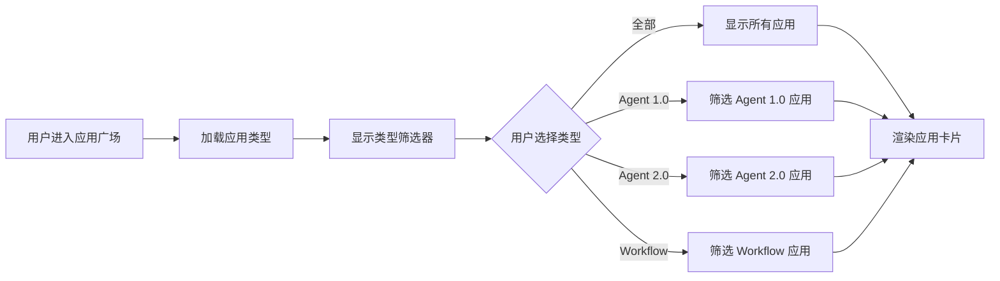
```mermaid
flowchart LR
    A[用户进入应用广场] --> B[加载应用类型]
    B --> C[显示类型筛选器]
    C --> D{用户选择类型}
    D -->|全部| E[显示所有应用]
    D -->|Agent 1.0| F[筛选 Agent 1.0 应用]
    D -->|Agent 2.0| G[筛选 Agent 2.0 应用]
    D -->|Workflow| H[筛选 Workflow 应用]
    E --> I[渲染应用卡片]
    F --> I
    G --> I
    H --> I
```

## Function Calling Schema 生成流程

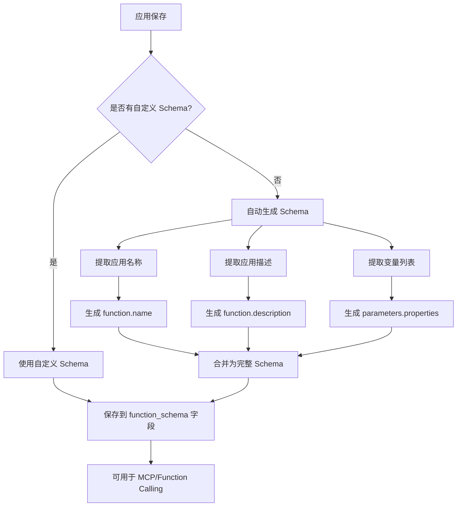
```mermaid
flowchart TD
    A[应用保存] --> B{是否有自定义 Schema?}
    B -->|是| C[使用自定义 Schema]
    B -->|否| D[自动生成 Schema]
    D --> E[提取应用名称]
    D --> F[提取应用描述]
    D --> G[提取变量列表]
    E --> H[生成 function.name]
    F --> I[生成 function.description]
    G --> J[生成 parameters.properties]
    H --> K[合并为完整 Schema]
    I --> K
    J --> K
    C --> L[保存到 function_schema 字段]
    K --> L
    L --> M[可用于 MCP/Function Calling]
```

## 组件动态加载机制

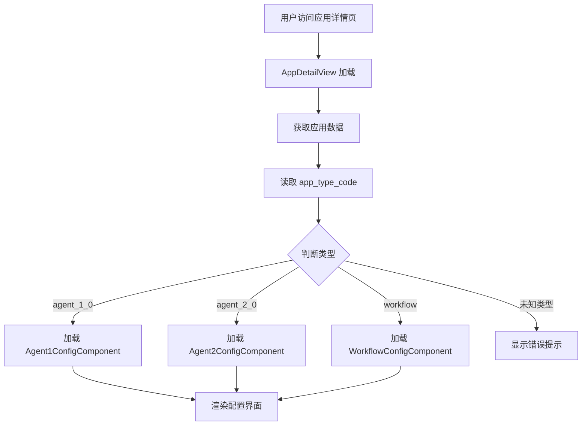
```mermaid
flowchart TD
    A[用户访问应用详情页] --> B[AppDetailView 加载]
    B --> C[获取应用数据]
    C --> D[读取 app_type_code]
    D --> E{判断类型}
    E -->|agent_1_0| F[加载 Agent1ConfigComponent]
    E -->|agent_2_0| G[加载 Agent2ConfigComponent]
    E -->|workflow| H[加载 WorkflowConfigComponent]
    E -->|未知类型| I[显示错误提示]
    F --> J[渲染配置界面]
    G --> J
    H --> J
```

## 安全验证流程

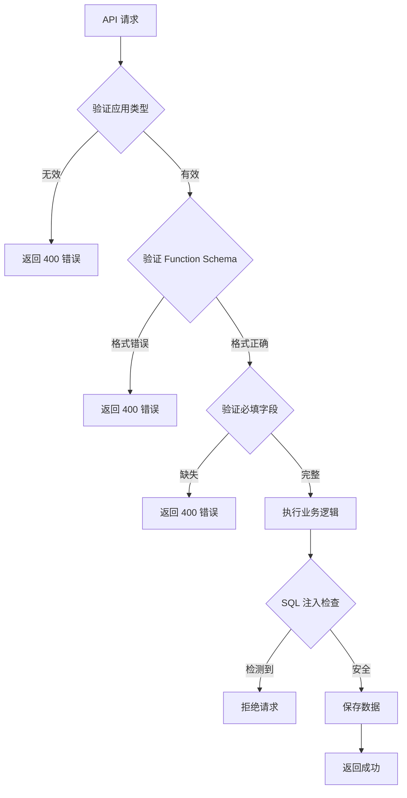
```mermaid
flowchart TD
    A[API 请求] --> B{验证应用类型}
    B -->|无效| C[返回 400 错误]
    B -->|有效| D{验证 Function Schema}
    D -->|格式错误| E[返回 400 错误]
    D -->|格式正确| F{验证必填字段}
    F -->|缺失| G[返回 400 错误]
    F -->|完整| H[执行业务逻辑]
    H --> I{SQL 注入检查}
    I -->|检测到| J[拒绝请求]
    I -->|安全| K[保存数据]
    K --> L[返回成功]
```

## 扩展路径

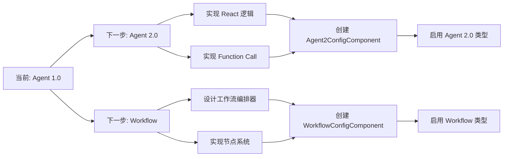
```mermaid
graph LR
    A[当前: Agent 1.0] --> B[下一步: Agent 2.0]
    B --> C[实现 React 逻辑]
    B --> D[实现 Function Call]
    C --> E[创建 Agent2ConfigComponent]
    D --> E
    E --> F[启用 Agent 2.0 类型]
    
    A --> G[下一步: Workflow]
    G --> H[设计工作流编排器]
    G --> I[实现节点系统]
    H --> J[创建 WorkflowConfigComponent]
    I --> J
    J --> K[启用 Workflow 类型]
```

## 技术栈

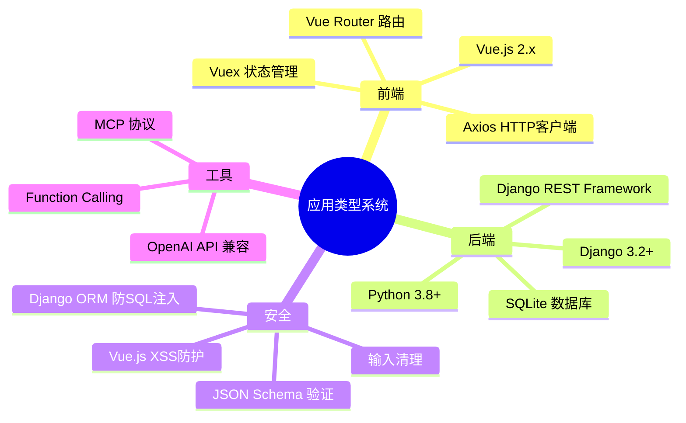
```mermaid
mindmap
  root((应用类型系统))
    前端
      Vue.js 2.x
      Vuex 状态管理
      Axios HTTP客户端
      Vue Router 路由
    后端
      Django 3.2+
      Django REST Framework
      SQLite 数据库
      Python 3.8+
    安全
      Django ORM 防SQL注入
      Vue.js XSS防护
      JSON Schema 验证
      输入清理
    工具
      Function Calling
      MCP 协议
      OpenAI API 兼容
```

## 性能优化点

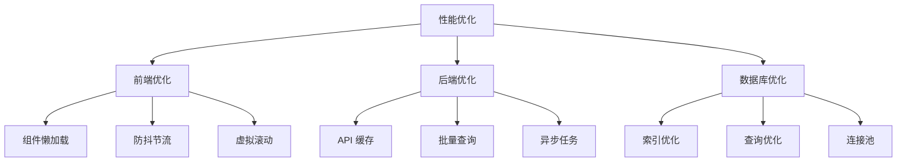
```mermaid
flowchart TD
    A[性能优化] --> B[前端优化]
    A --> C[后端优化]
    A --> D[数据库优化]
    
    B --> B1[组件懒加载]
    B --> B2[防抖节流]
    B --> B3[虚拟滚动]
    
    C --> C1[API 缓存]
    C --> C2[批量查询]
    C --> C3[异步任务]
    
    D --> D1[索引优化]
    D --> D2[查询优化]
    D --> D3[连接池]
```

## 监控和日志

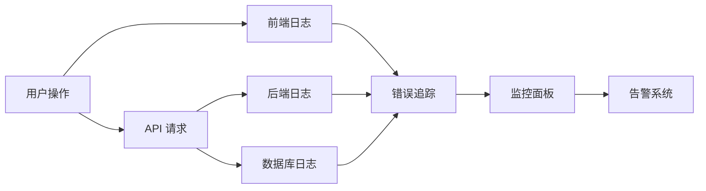
```mermaid
flowchart LR
    A[用户操作] --> B[前端日志]
    A --> C[API 请求]
    C --> D[后端日志]
    C --> E[数据库日志]
    
    B --> F[错误追踪]
    D --> F
    E --> F
    
    F --> G[监控面板]
    G --> H[告警系统]
```
